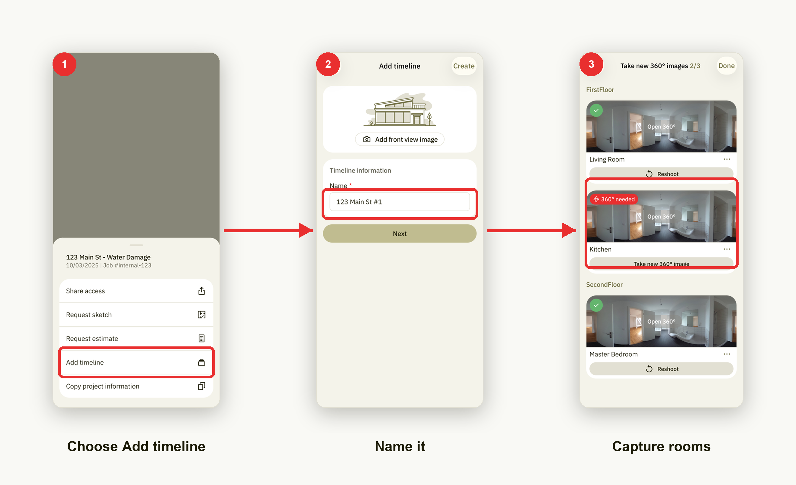

# Add a timeline

A **timeline** is a follow-up visit to the same property — handy for tracking
drying progress or documenting changes between visits. Adding one takes three
steps.

1. **Choose Add timeline.** From a project, tap the menu button to open the
   actions sheet, then choose **Add timeline**.
2. **Name it.** On the **Add timeline** screen, fill in the **Name** field under
   *Timeline information*, then tap **Next**. Camera and ceiling heights aren't
   asked here — you set those per room while capturing.
3. **Capture rooms.** The timeline opens its room list. Shoot a new 360° image
   for each room (rooms that still need one are marked **360° needed**), then tap
   **Done**.
