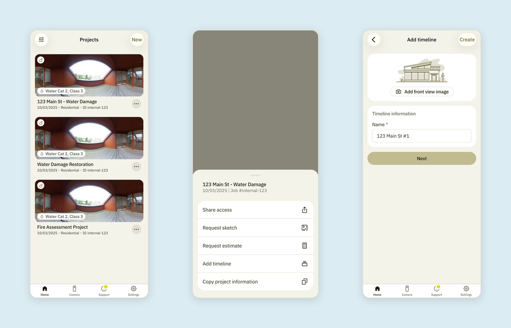
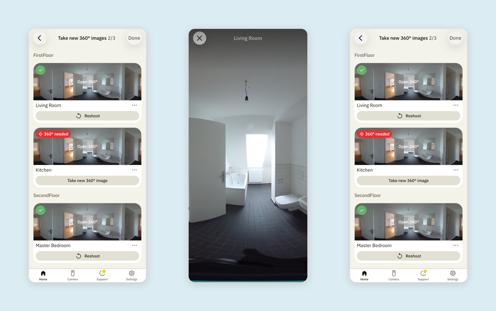
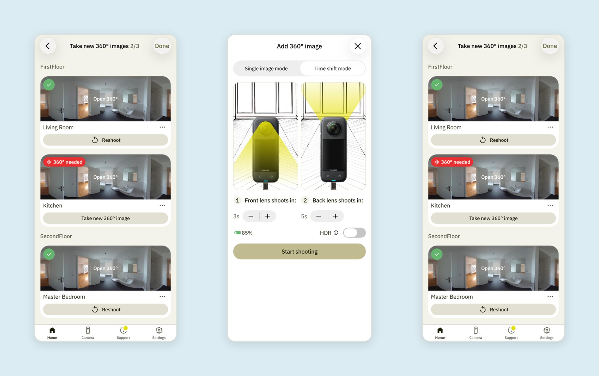
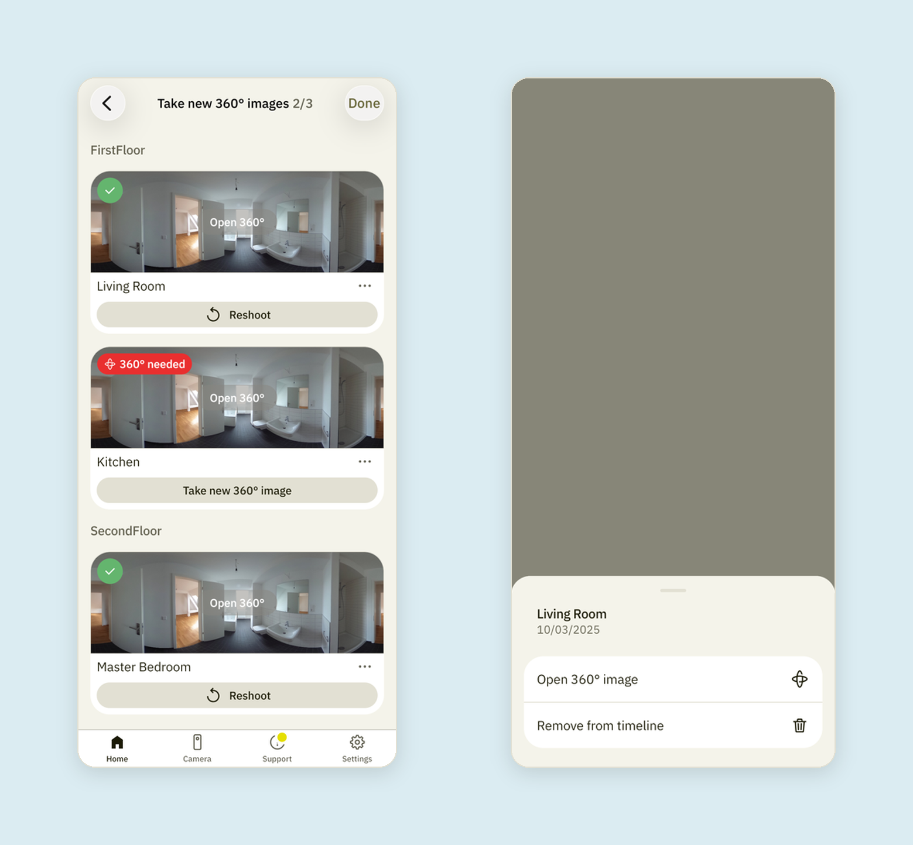
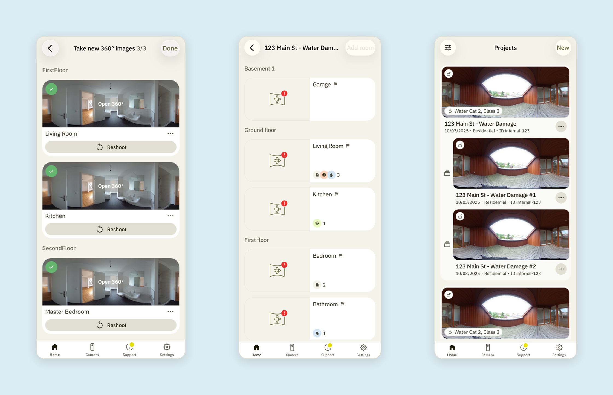
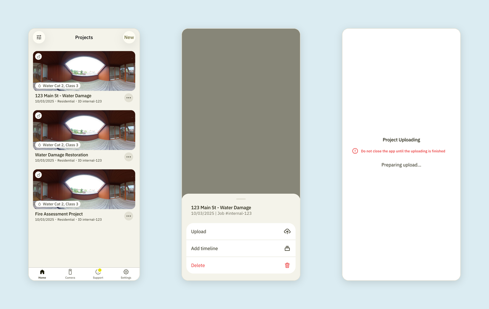
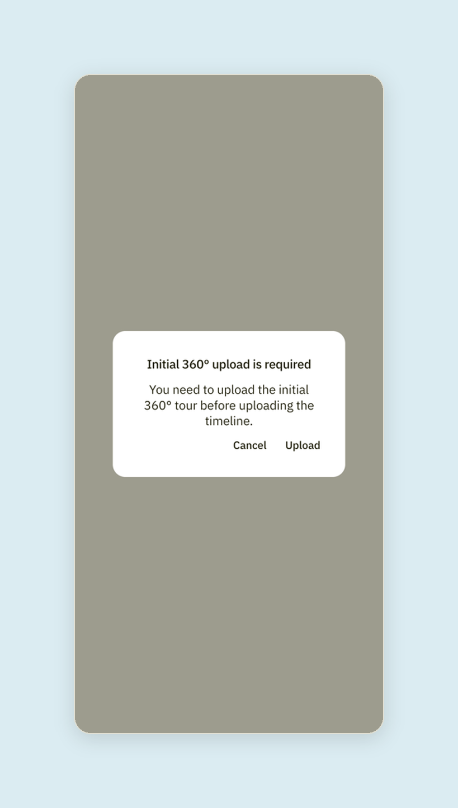

# How to Add a Timeline

Find the initial 360° tour (not a timeline) in your project list and tap the
**3 dots**. Select "**Add timeline**." Fill out the timeline information and tap
"**Next**":

If you want to view your previous 360° image, tap **the 360° image preview** for
the room. To return, tap the **cross icon**:

To start capturing a new 360° image for the room, tap "**Take new 360° image**"
and complete the shooting process. Once the 360° image is taken, you will see a
green check icon in the upper-left corner of the room preview:

The three dots icon next to the "Take new 360° image" button can be tapped to
either **open the 360° image** or **remove it from the timeline**:

After you updated all the 360° images you needed to, tap "**Done**" and return to
the project list by tapping **the back arrow**:

**Upload** the timeline:

!!! note
    If you try to upload a timeline for the initial 360° tour (parent tour) that
    hasn't been uploaded yet, a warning message will prompt you to upload the
    initial 360° tour first.

