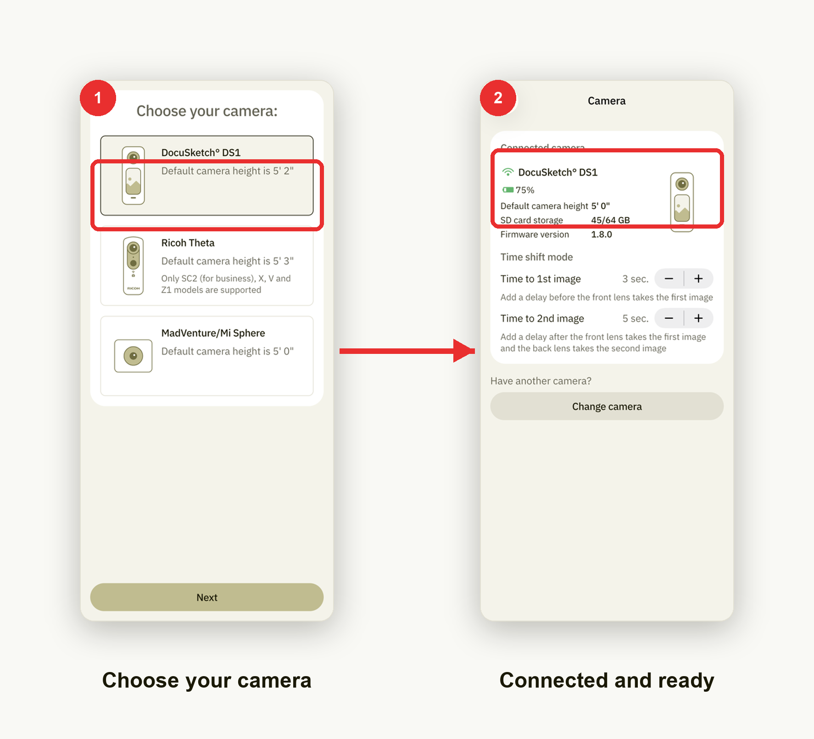

# Connect the camera

Pair a 360° camera with the app before you start shooting a tour.

1. **Choose your camera.** On the **Choose your camera:** screen, select your
   model from the list.
2. **Connected and ready.** Once paired, the camera shows as connected, along
   with its battery, SD card storage and firmware version. You're ready to
   capture.
