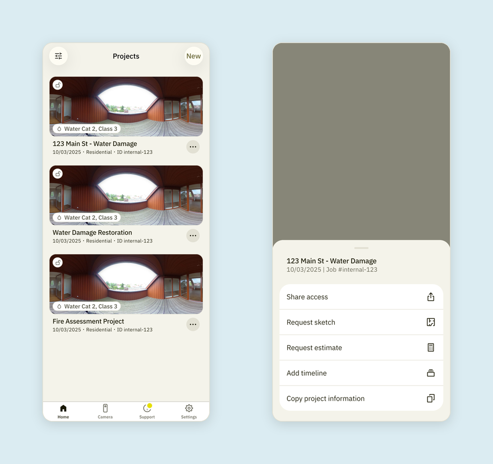
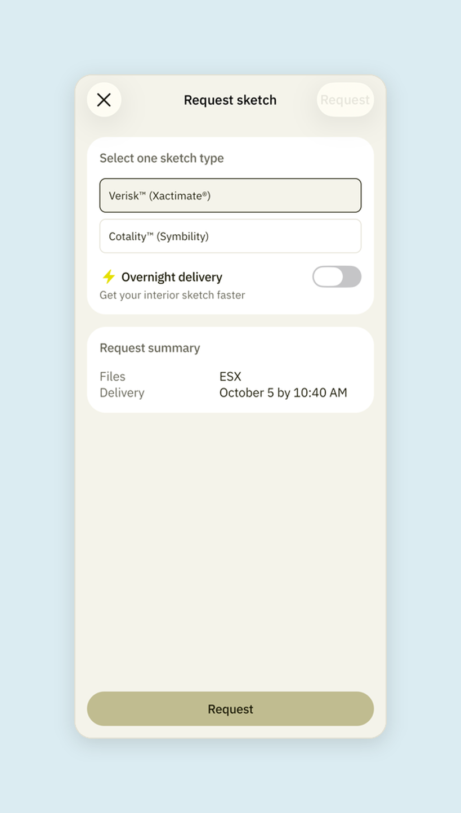
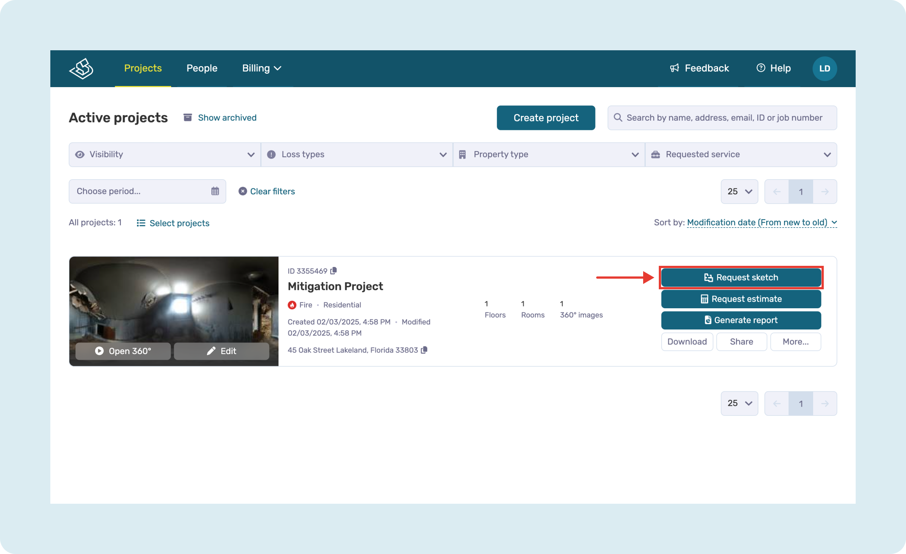
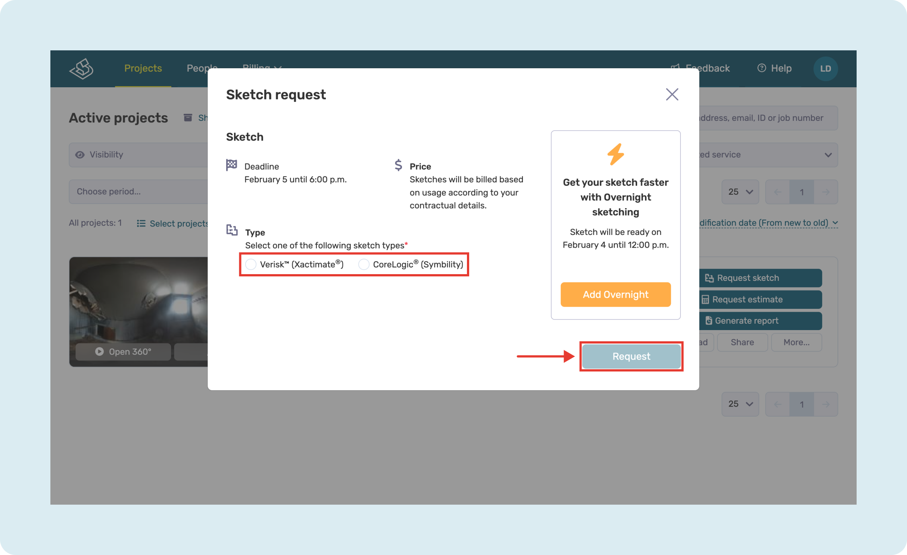

# How to Request a Sketch

Once you have [uploaded your project](https://help.docusketch.com/documentation/docs/how-to-upload-a-project) (opens in new tab), you can now request a sketch.

## On Mobile App

Go to the **project list**, tap the **3 dots** on the project card and select "**Request sketch**":

Choose one of the sketch types. You can enable "**Overnight delivery**" if your contract includes it. Tap "**Request**":

!!! note
    [Sketch pricing](https://help.docusketch.com/docs/sketch-credits) (opens in new tab) depends on your subscription and the size of your 360° tour.

You will receive an email confirming your request. Once your sketch is ready, you will receive another email notification.

## On Web Portal

To request a sketch on the [Web Portal](https://app.docusketch.com/portal) (opens in new tab), find the project you need and click "**Request sketch**":

Select the sketch type you need, then click "**Request**":

