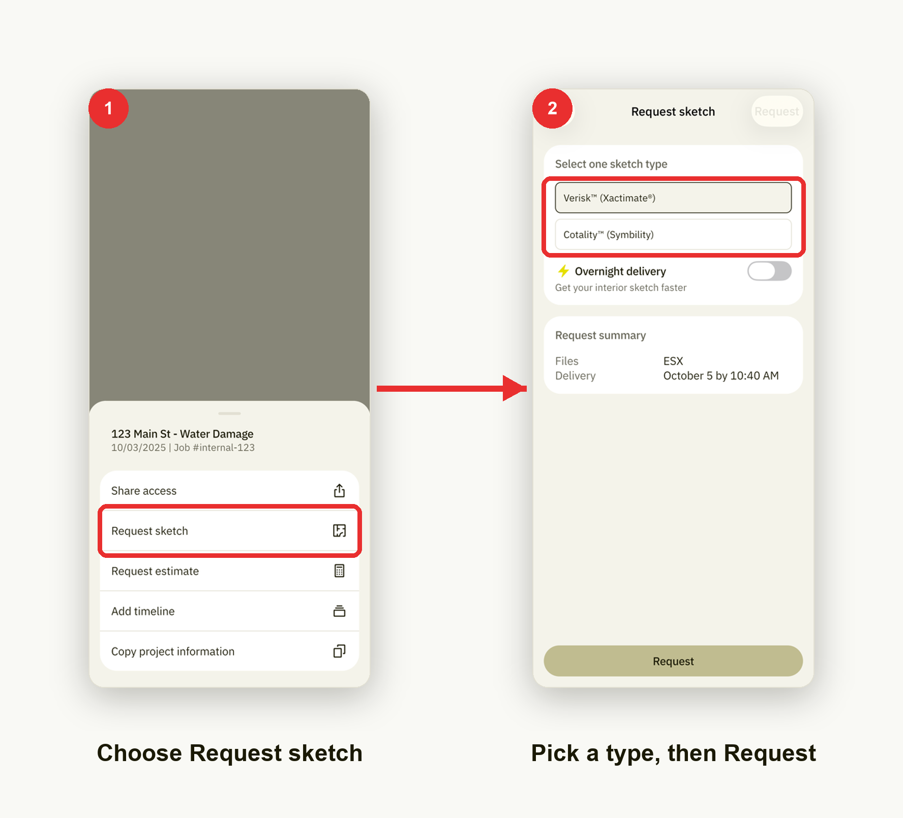

# Request a sketch

Order a floor-plan sketch once a tour has been uploaded.

1. **Choose Request sketch.** From a project, tap the menu button to open the
   actions sheet, then choose **Request sketch**.
2. **Pick a type, then Request.** On the **Request sketch** screen, select a
   sketch type — **Verisk™ (Xactimate®)** or **Cotality™ (Symbility)** — turn on
   **Overnight delivery** if you need it faster, then tap **Request**.
