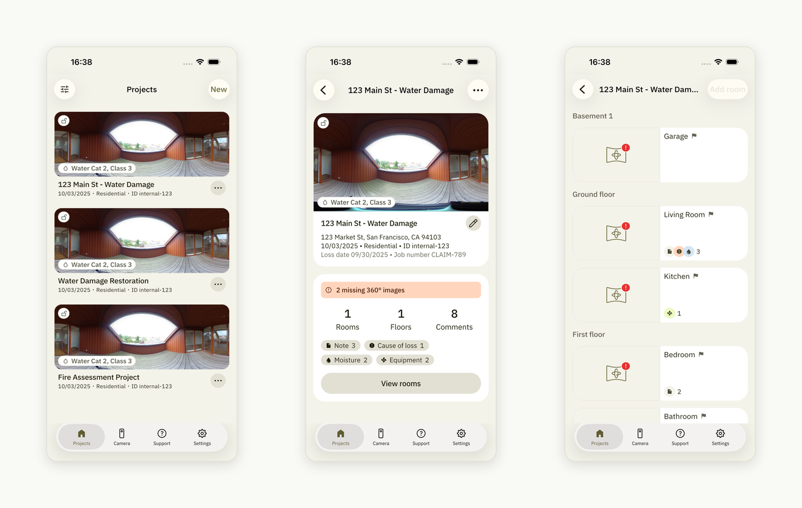
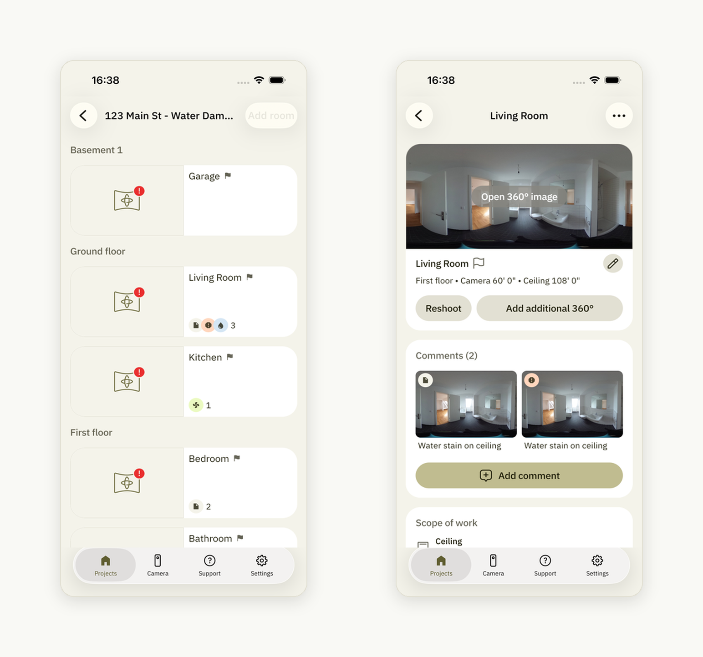

# How to Reshoot 360° Images in a Project

Open the project you need, tap "**View rooms**," and select the room where you want to retake the 360° image:

After selecting the room, you will be redirected to the page where you can find the "**Reshoot**" button. Tap it to capture a new 360° image for the chosen room and replace the current one:

Make sure to [upload the tour](https://help.docusketch.com/docs/uploading-your-tour-and-generating-sketch#how-to-upload-your-tour) (opens in new tab) after you have replaced the 360° images for the project.
