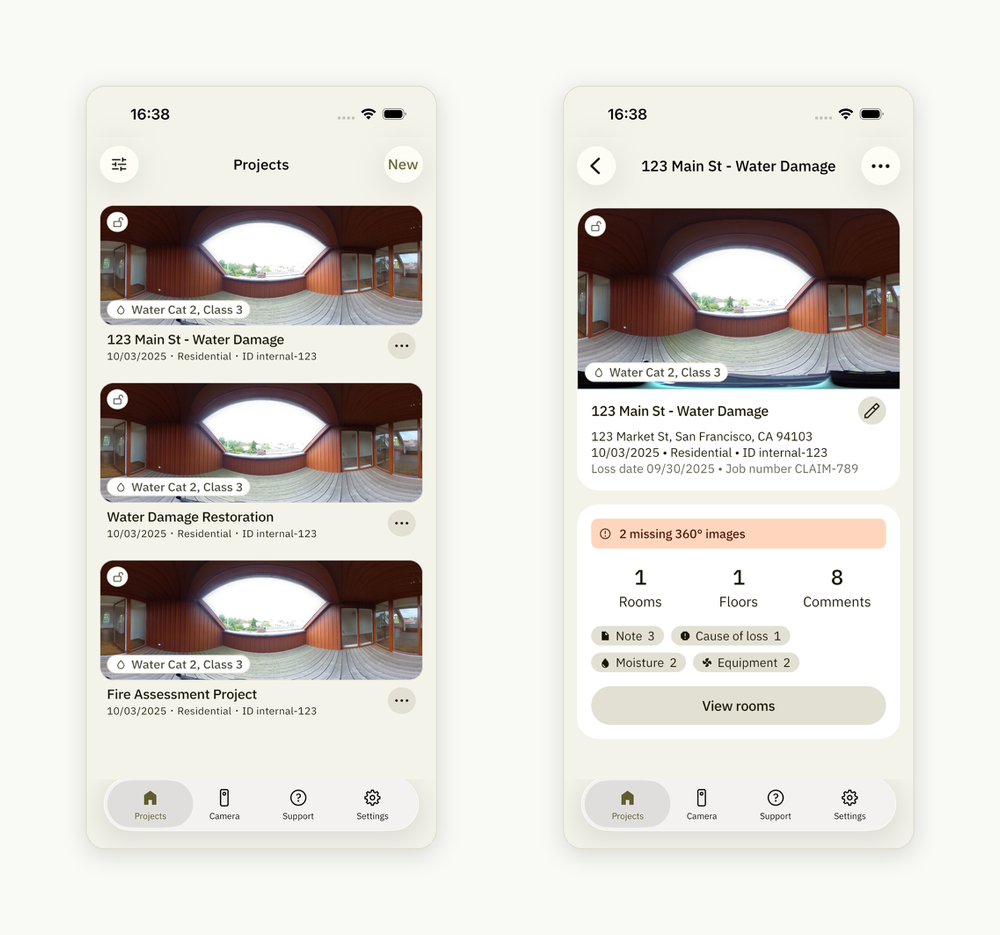
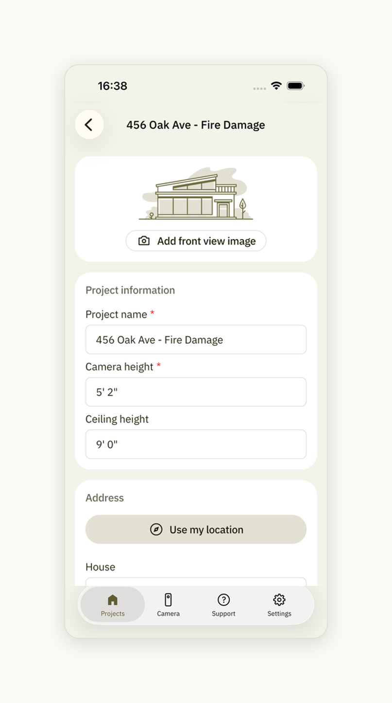
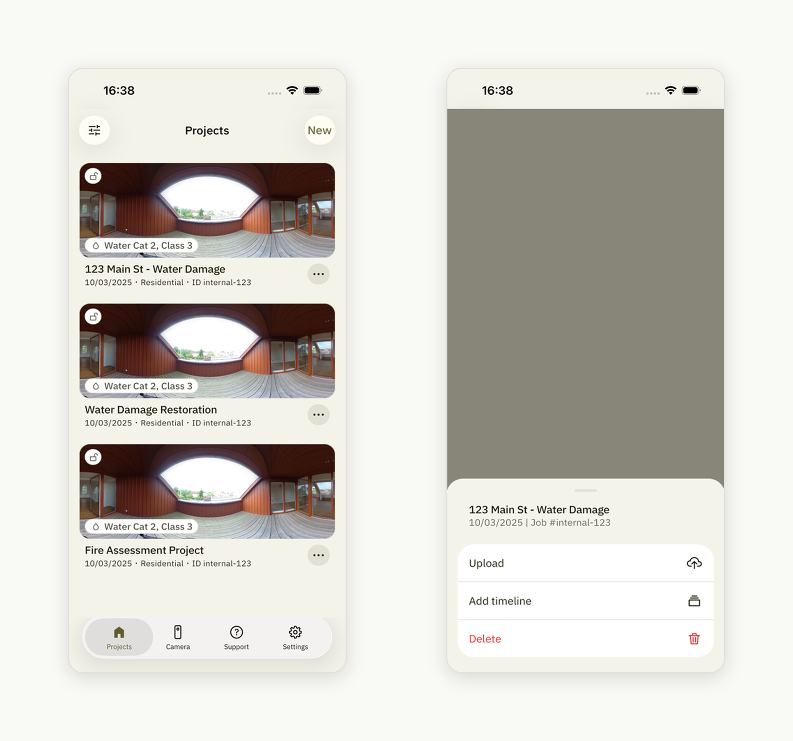
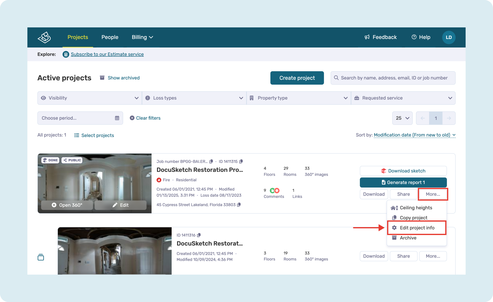
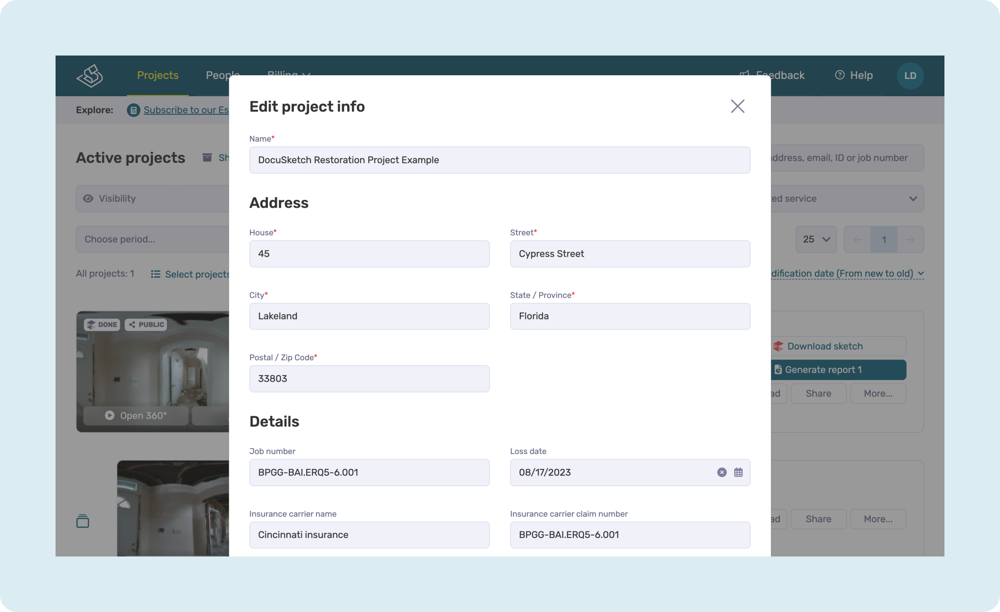

# How to Update Project Information

## On Mobile App

Tap the **project thumbnail**, then tap the **project information** to update its details.

All additional project details can also be edited from here:

Once done, tap the **back** button and go back to the project list, then tap the **three dots** on your project and select "**Upload**":

## On Web Portal

Locate the project you want to edit, click on the "**More**" button and select "**Edit project info**":

Update the information and click "**Save**" when done:

