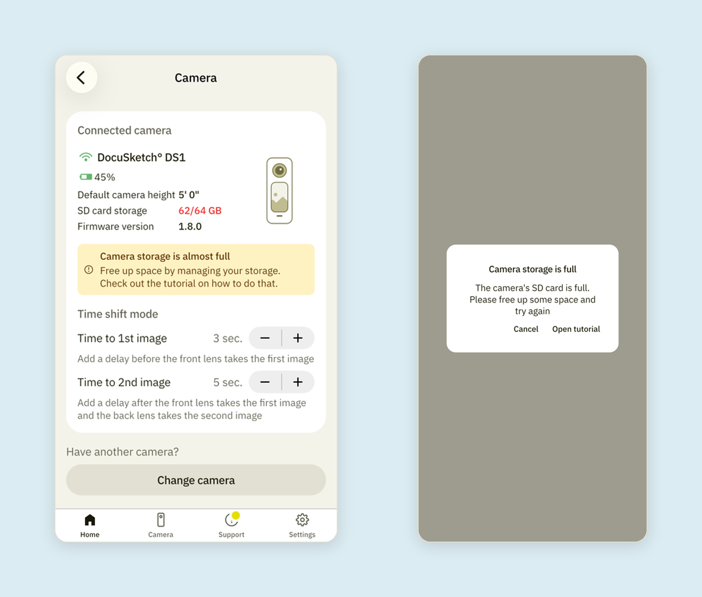
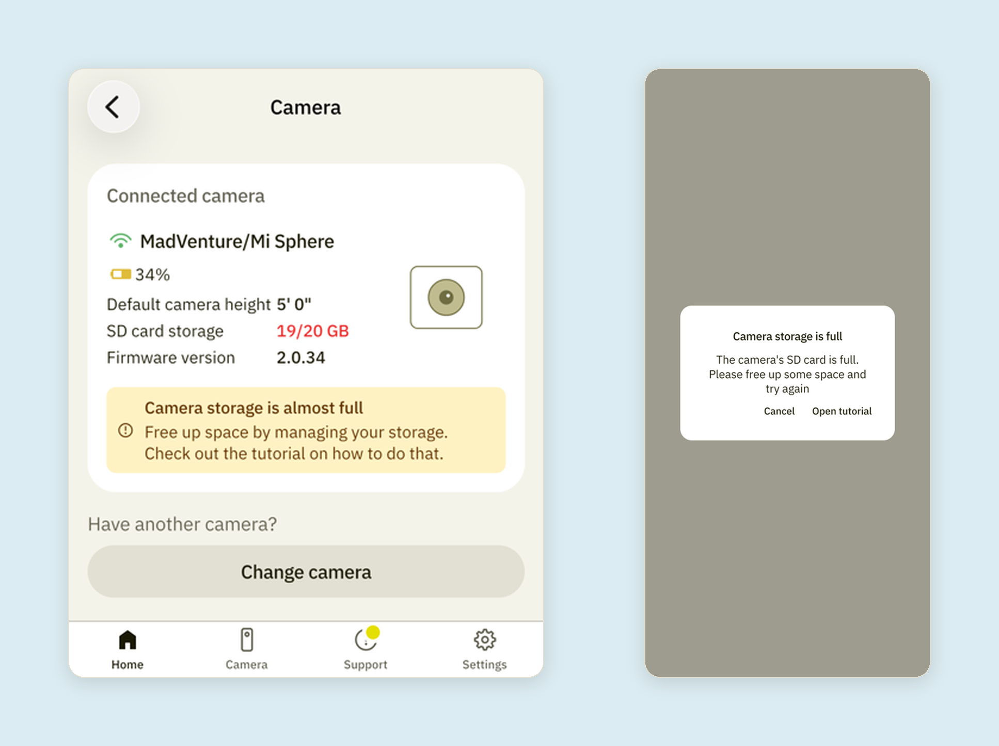

# Notification Alert that the Camera Storage is Full

Eventually, the 360° images stored in your camera will approach the camera's storage capacity. When that occurs, a warning will appear during the shooting process.

## DocuSketch DS1 Camera

Tap on the warning to view the tutorial for managing the available space in your camera's storage:

## Ricoh Theta

Tap on the warning to view the tutorial for managing the available space in your camera's storage:

## MadVenture/Mi Sphere

Tap on the warning to view the [tutorial](https://help.docusketch.com/docs/how-to-clear-contents-on-a-misphere-or-madventure-camera) (opens in new tab) for managing the available space in your camera's storage:

